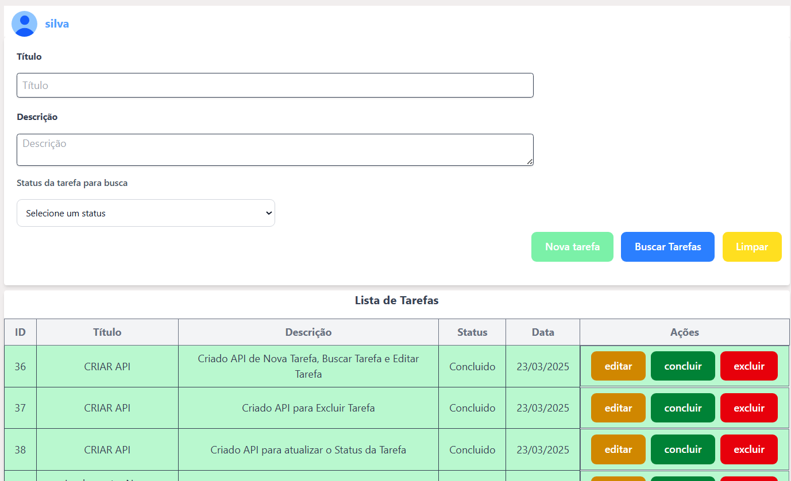

# React + Vite

This template provides a minimal setup to get React working in Vite with HMR and some ESLint rules.

Currently, two official plugins are available:

- [@vitejs/plugin-react](https://github.com/vitejs/vite-plugin-react/blob/main/packages/plugin-react/README.md) uses [Babel](https://babeljs.io/) for Fast Refresh
- [@vitejs/plugin-react-swc](https://github.com/vitejs/vite-plugin-react-swc) uses [SWC](https://swc.rs/) for Fast Refresh

# :📜: Passos para rodar a aplicação

# 1. Clone o repositório
- Clone o repositório com os comandos 
- git clone https://github.com/your-username/your-repo-name.git

# 2. Instale as dependências
- Utilize o seguinte comando para criar a pasta node_modules
- yarn install ou npm install
    - Verifique se possui o [NodeJS](https://nodejs.org/en) instalado com node --version
    - E o [yarn](https://classic.yarnpkg.com/en/docs/install#windows-stable) para gerenciamento dos pacotes

# 3. Inicie a aplicação web que será aberto a aplicação
- Utilize o comando yarn dev ou npm run dev
 - Verifique em package.json como está o scripts:
    - caso esteja assim "scripts": {
        "dev": "vite",
        "build": "vite build",
        "serve": "vite serve"
        },
        O comando para iniciar a aplicação será yarn dev ou npm run dev

# 4. Acesse a aplicação no navegador
- Acesse qualquer navergador com o link criado http://localhost:5173

  

# 5 Realize o clone do repositório backend
- Clone o repositório com os comandos
- git clone https://github.com/LeandroDev00/Chromasoft-backend
- Siga as instruções do repositório

